# Kita Kunterbunt

## todos

- Impressum checken
- Galerie für Einrichtung hinzufügen
- Media Queries
- SEO Daten
- about: overflow: hidden

## Contributor

- [Mia Mecklenburg](https://github.com/MiaMarmeladenbrot)

## Links

- [See live site here](https://www.kunterbunt-friesoythe.com/)
- [GitHub Repository](https://github.com/MiaMarmeladenbrot/pia)
- [GitHub Author](https://github.com/MiaMarmeladenbrot)
- [LinkedIn Author](https://www.linkedin.com/in/ann-marie-mia-mecklenburg-99756016a/)

## Screenshots

### Desktop Version

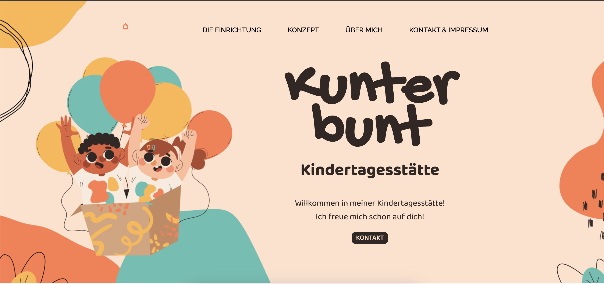
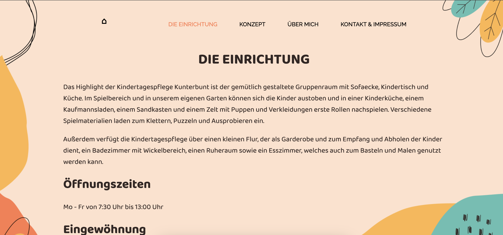
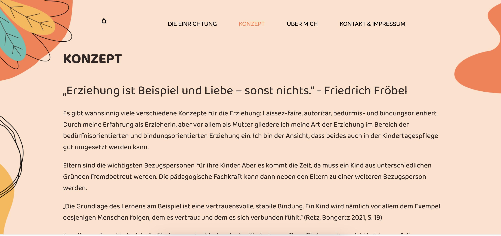
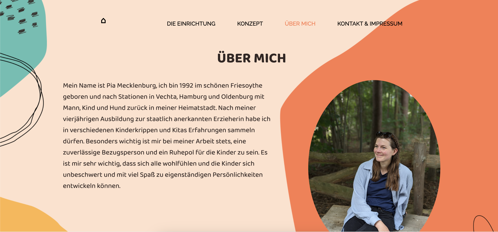
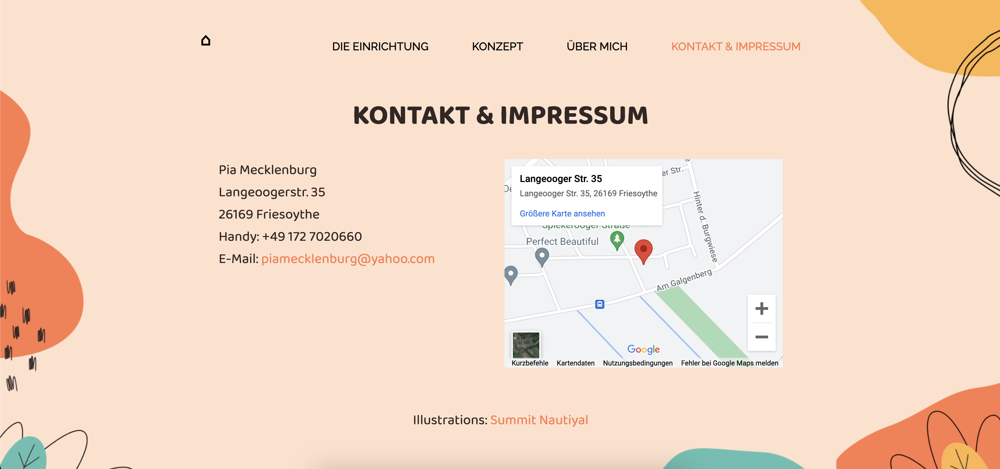

### Tablet Version

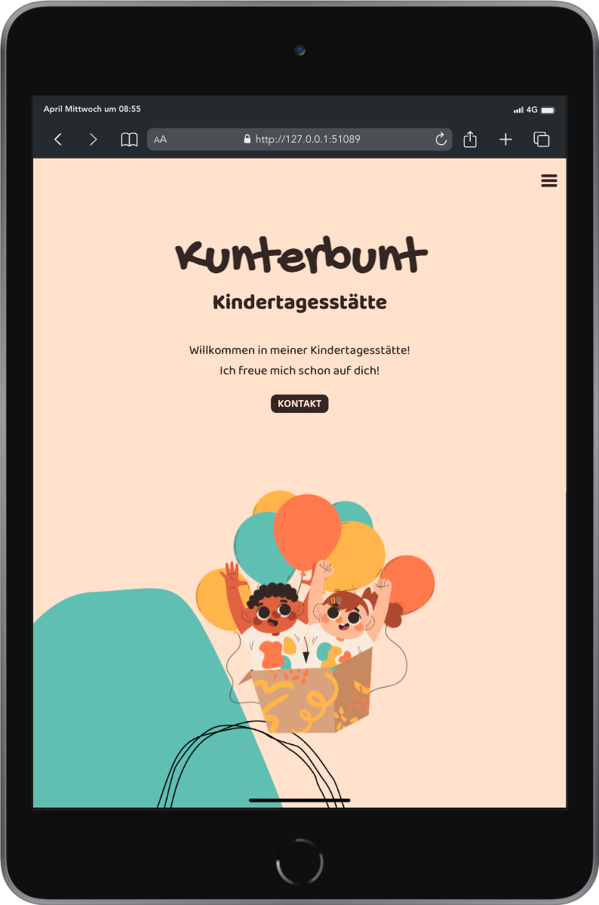
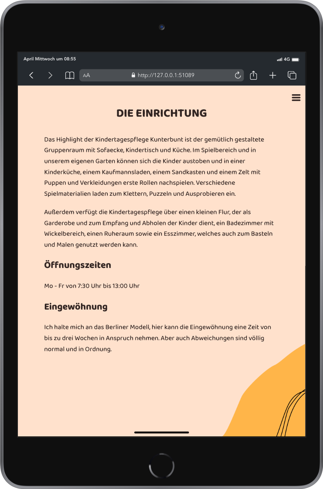
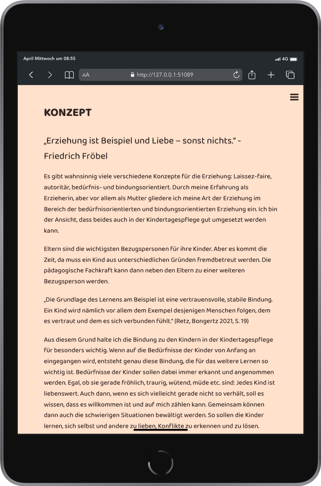
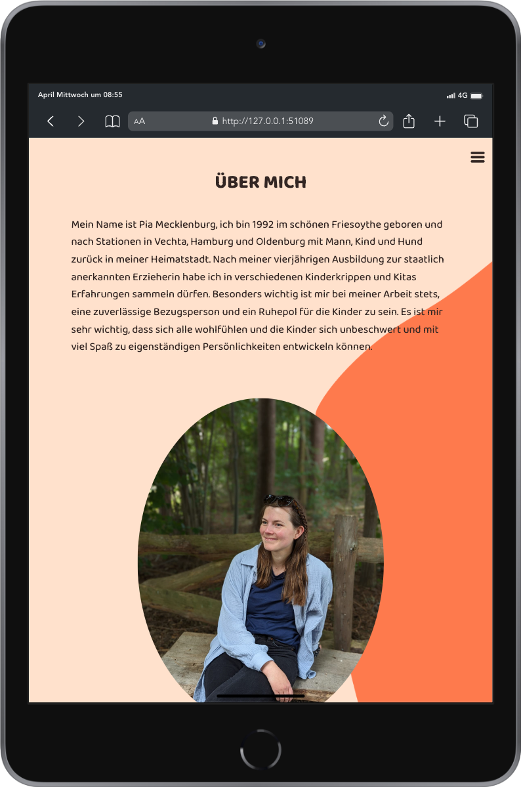
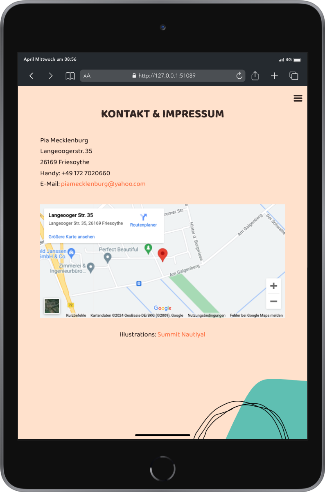

### Mobile Version

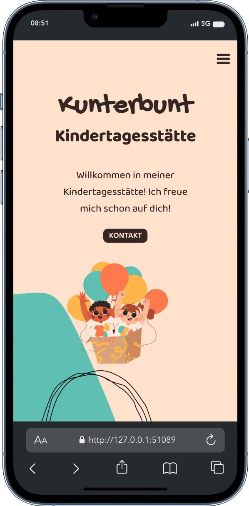
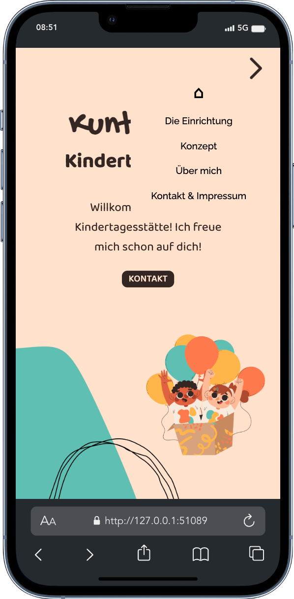
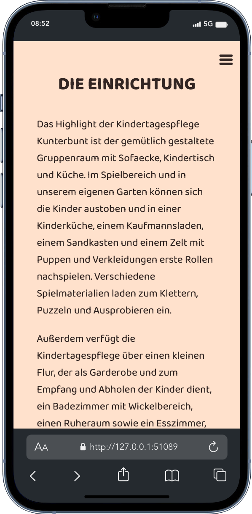
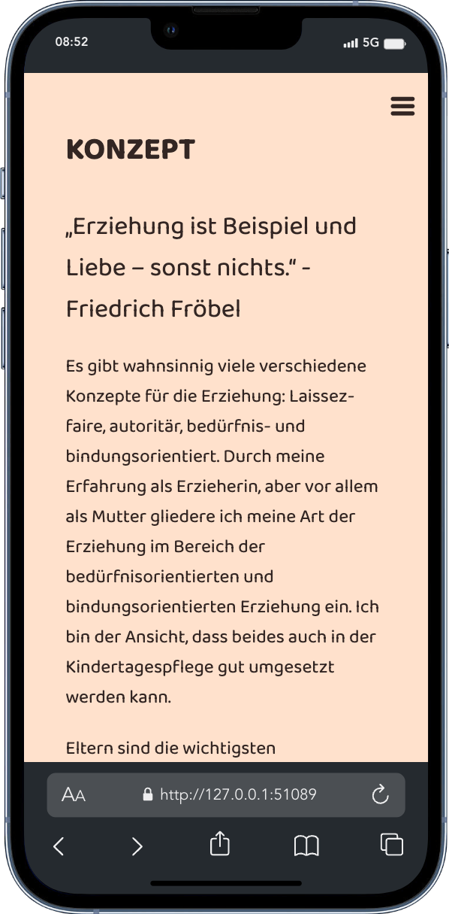
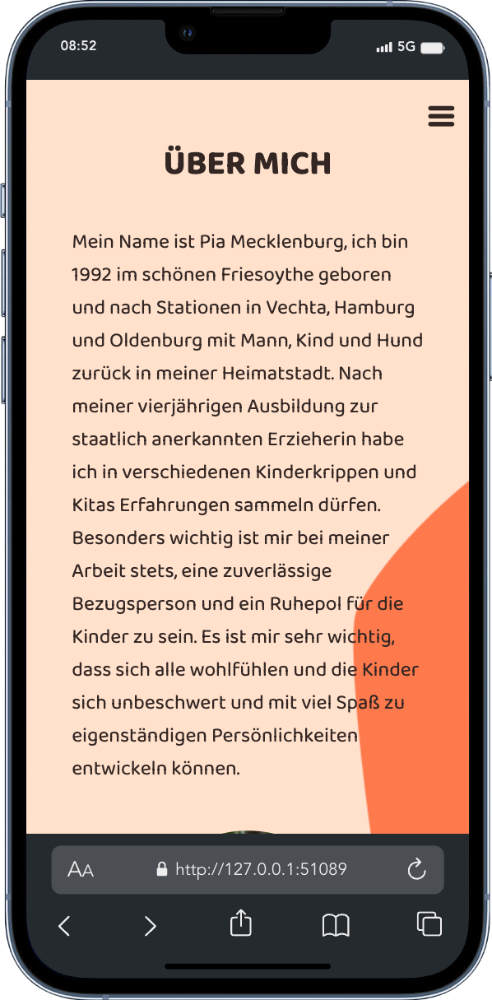
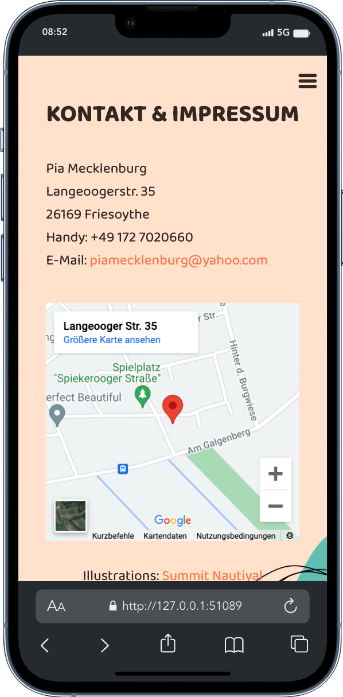
